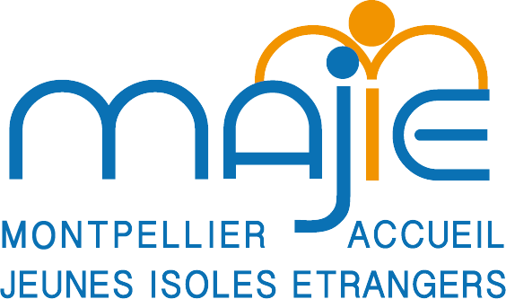
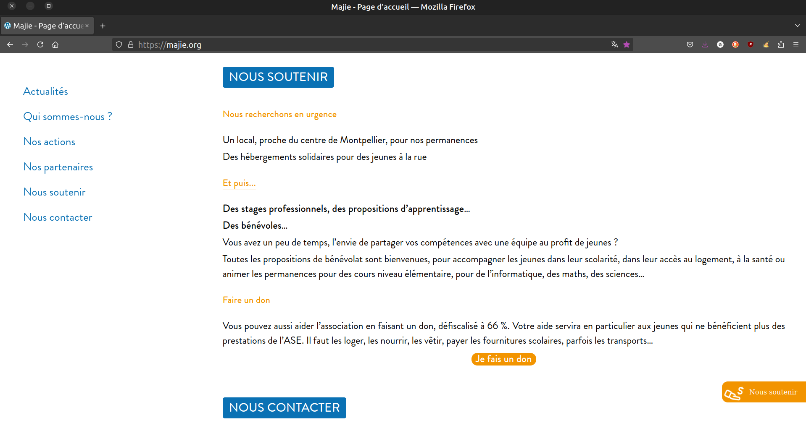

  

# 🕊️ majie.org  
Showcase website for the Majie NGO, based in Montpellier, France.

---

## 📖 Overview

This project is the official website of **Majie**, an organization based in Montpellier, France, working in the reception and support of unaccompanied foreign minors.

The goal of the redesign was to:
- Improve the clarity and accessibility of information
- Ensure a clean and responsive navigation experience
- Simplify content management for editors using WordPress and ACF Pro

---

## 🖥️ Demo

> 📷 *Screenshot of the site*

---

## 🚀 Installation

This project uses a standard WordPress installation.

1. Download WordPress: https://wordpress.org/download/
2. Clone or copy the custom theme into `/wp-content/themes/`
3. Install required plugins:
   - ACF Pro (licensed version)
   - Contact Form 7
4. Activate the theme in the WordPress admin
5. Configure fields and content using the ACF interface

---

## 💡 Technologies Used

- 🌀 **WordPress** (custom theme)
- 🛠️ **PHP** (theme logic & templating)
- 🌿 **Vanilla JavaScript**
- 🔌 Plugins:
  - [ACF Pro](https://www.advancedcustomfields.com/pro/)
  - [Contact Form 7](https://contactform7.com/)

---

## 👤 About the Developer

  
Developed by <a href="https://evendev.net"><strong>Guillaume Even</strong></a>

  

